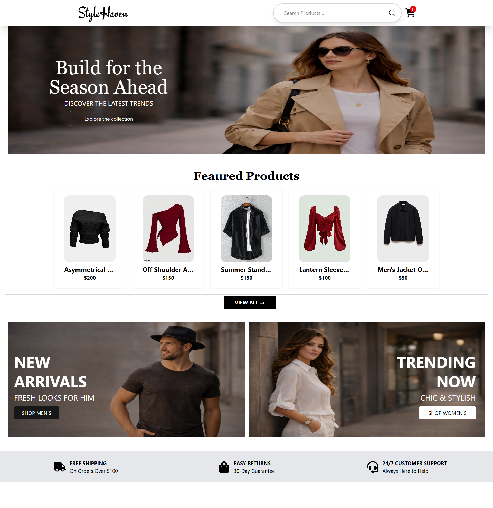
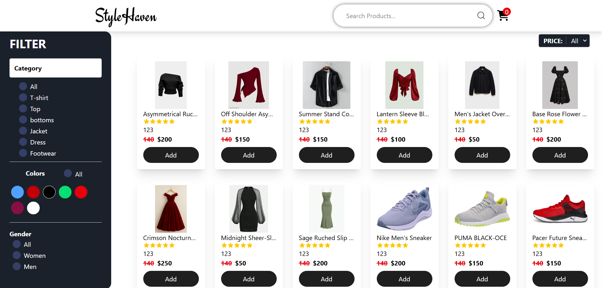
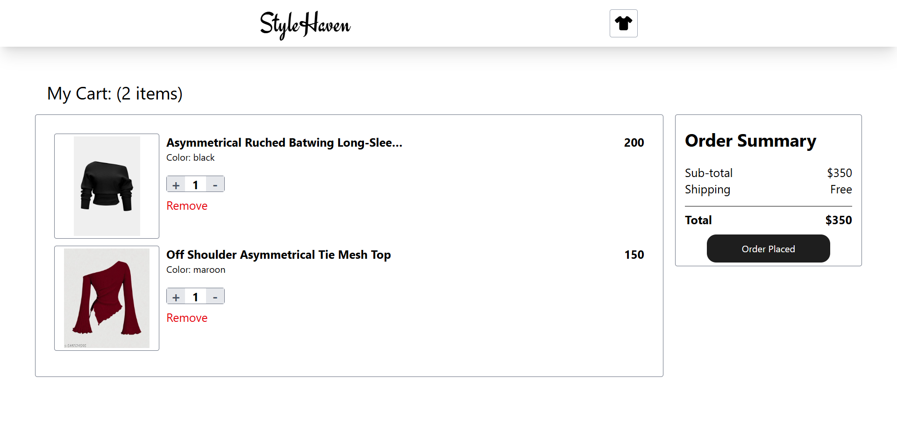
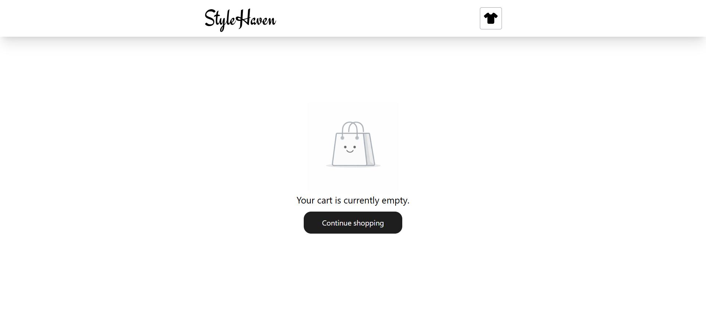

# E-commerce Clothing Store

A responsive e-commerce clothing website built with React, featuring clean UI, cart management, and order flow.

## Screenshots

## Screenshots







## Live Demo
(Add your deployed link here)

## Tech Stack
- React
- Context API (for cart state management)
- Tailwind CSS
- Vite

## Features
- Product listing with images and pricing
- Add / remove products from cart
- Quantity increment / decrement
- Cart total price calculation
- Order placement and cancel order flow
- Empty cart UI state
- Fully responsive design

## License
This project is licensed under the MIT License - see the [LICENSE](LICENSE) file for details.

## Getting Started

Follow these steps to run the project locally:

    ```bash
      # Clone the repository
      git clone <"https://github.com/Harsimrankaur2004/StyleHaven.git">

      # Navigate into the project folder
      cd ecommerce-react

      # Install dependencies
      npm install

      # Start the development server
      npm run dev


